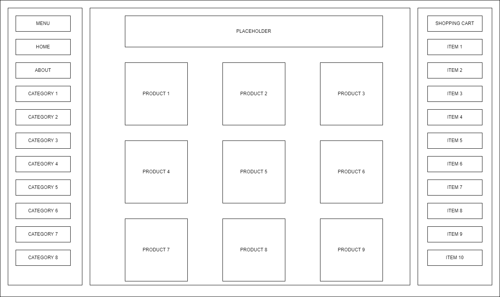
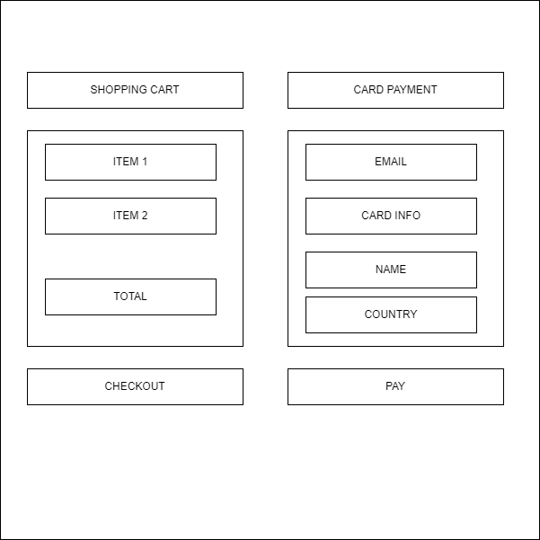

# Week 7 Assignment

## Assignment Requirements

* Name of the project
  * Digital Assets Storefront
* Elevator Pitch
  * The web app provides easily accessible digital assets and a fast checkout process via integration with the Stripe API. Firebase firestore is used to manage the collection of items. The target audience includes tech enthusiasts, game developers or web developers. The users can sign in with their Google Account and add items to a shopping cart. Users can also favorite items. 
* Wireframe
  * 
  * 
* Dependencies
  * Firebase 
  * Stripe API
  * Express
* Tasks
  * Setup `create-react-app` scaffold
  * Create layout
  * Create Side bar with menu and product categories
  * Create a products view
  * Create a shopping cart
  * Create a users form
  * Create a favorites view
  * Create a collection of users in Firestore
  * Create a collection of products in Firestore
  * Connect the front end to firestore
  * Test fetch functionality
  * Implement the backend
  * Test Stripe checkout functionality
* A plan for the next 3 weeks and what you plan to accomplish each week
  * Week 1
    * Implement the frontend
    * Test buttons, links, shopping cart
    * Styles tweaks
  * Week 2
    * Implement the database
    * Test fetch use cases
    * Styles tweaks
  * Week 3
    * Implement the backend
    * Test Stripe API responses
    * Deploy

## Nice to haves

* The server side might take longer than expected and not be complete by the time of submission
* Implement shipping cost estimation
* Implement tax estimation
* Implement other payment methods

