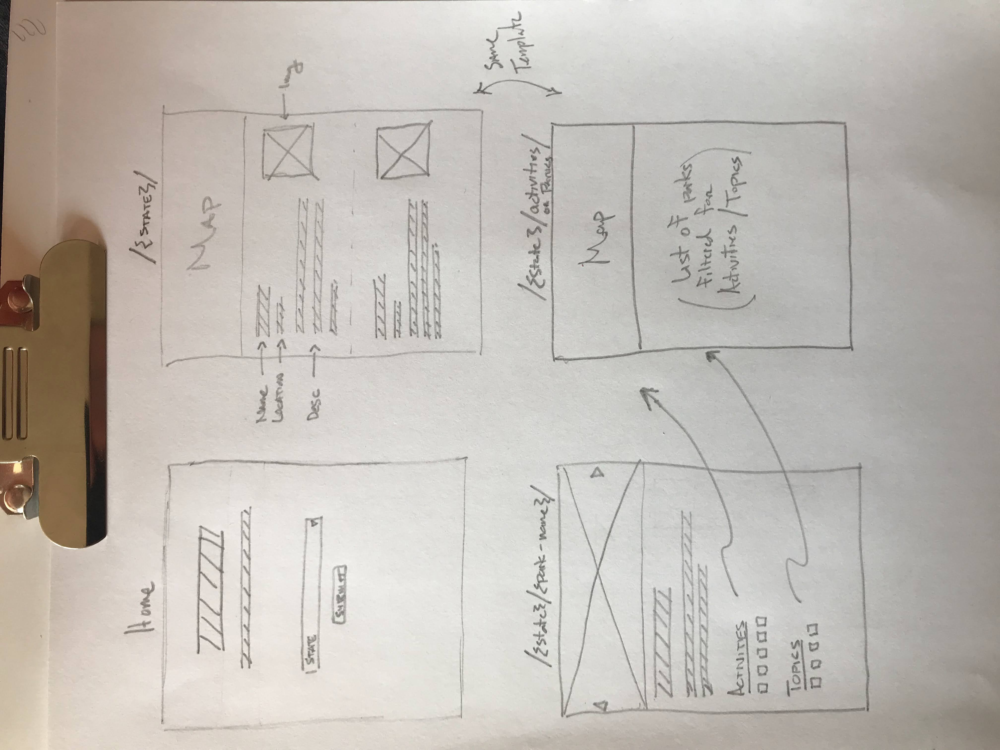

# JScript Final Project Summary

## Project Name

National Park Explorer

## Elevator Pitch

Quickly find and explore any US national park. Filter parks based on activity or topic the park helps you explore.

## Wireframes

## Dependencies

- React
- NPM modules
  - React router
  - Formik
  - Bootstrap
  - Firebase
    - Store favorite parks
    - Rate a park
- SCSS

## Task list

- Set up base React project
- Connect to National Parks API
- Set up home page to allow for state selection
- Display park data list on /{state}/ page
- Display specific park data on /{state}/{park-name}/ page
- Create /activites and /topics pages for filtering
- Add Google map API to /{state}, /actitivies, and /topics pages
- Set up carousel on /{state}/{park-name}/ page
- Create user authentication to allow for "favoriting" parks
- Testing / PropTypes

## Plan

- Week 1
  - Set up base React project
  - Connect to National Parks API
  - Set up home page to allow for state selection
  - Display park data list on /{state}/ page
- Week 2
  - Display specific park data on /{state}/{park-name}/ page
  - Create /activites and /topics pages for filtering
  - Add Google map API to /{state}, /actitivies, and /topics pages
- Week 3
  - Set up carousel on /{state}/{park-name}/ page
  - Create user authentication to allow for "favoriting" parks
  - Testing / PropTypes
